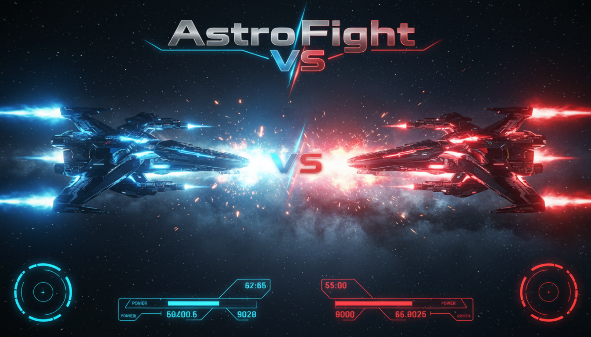

# AstroFight



AstroFight is a real-time 1v1 space shooter built for Solana devnet, with cinematic Three.js combat, wallet-based staking, and a server-secured payout path designed to evolve into a MagicBlock Ephemeral Rollup authoritative game loop.

## Overview

Players connect Phantom, enter a duel room, stake equal SOL, and launch into a live spaceship battle in a fully 3D arena. The game focuses on fast arcade dogfighting, readable laser combat, premium sci-fi presentation, and a clean on-chain match flow suitable for hackathon demos and devnet testing.

## Core experience

- 1v1 spaceship duel with direct face-to-face arena spawns
- Fully 3D battle scene with imported `.glb` ship models
- Laser-based combat with visible beam trails and impact effects
- Real wallet connection through Phantom
- On-chain devnet escrow deposit flow
- Server-side settlement path for winner payout
- MagicBlock ER-ready match-state architecture
- Responsive UI for desktop and mobile
- Background music loop plus laser and explosion SFX

## Gameplay

### Controls

- `W` / `Up Arrow`: move forward
- `S` / `Down Arrow`: move backward
- `A`: strafe left
- `D`: strafe right
- `Mouse`: aim ship heading
- `Left Click` or `Space`: fire laser
- `Shift`: boost

### Combat rules

- Each ship starts with `100 HP`
- Player lasers are green
- Enemy lasers are red
- Asteroids and planets act as real obstacles
- Ships cannot pass through planets or asteroids
- First pilot to reduce the opponent to `0 HP` wins
- Disconnects and timeout flows are tracked in match resolution

## Tech stack

- `React + TypeScript + Vite`
- `Three.js` via `@react-three/fiber` and `@react-three/drei`
- `Tailwind CSS`
- `Zustand`
- `Framer Motion`
- `Solana web3.js`
- `Phantom wallet adapter`
- `Anchor`
- `MagicBlock router / match-state integration scaffold`
- `Vercel-compatible server API routes`

## Solana architecture

### Escrow on Solana L1

AstroFight uses an Anchor escrow program to hold equal stake deposits from both players. Funds remain in escrow until the match result is finalized and the winner receives the full prize pool.

Deployed escrow program:

- `36jNz1GXXBV4DoXHETExtqHCawyw3sE9JhUNsn57BxAh`

### Match state

A separate `match_state` program is deployed to track authoritative room state and is structured to support MagicBlock delegation.

Deployed match-state program:

- `7k4vyWB43PQNUU2RVFsP8czAqhgV1Fv7w4e31AitM3FF`

### Why there is an arbiter

For the current hackathon build, the match is settled through a secure server-side settlement authority. The browser never holds the private key. Only the public key is exposed to the client.

Public arbiter:

- `9fmVEUnfwHvzezsGMLjrbjweydmf3vS8HBFUuanwhVhM`

## Current realtime model

The project is already structured for MagicBlock, but the live gameplay loop is still a hybrid prototype:

- local duel sync currently uses WebRTC transport
- MagicBlock router probing and room PDA derivation are wired
- server APIs prepare and finalize on-chain match-state
- escrow settlement now expects match-state participation

This means the app is strong enough for a devnet hackathon demo, while still being transparent that full ER-authoritative combat is the next major step.

## Media integration

The following custom assets are integrated into the game:

- banner image for project branding
- `lasershoot.mp3` for firing
- `explosion.mp3` for ship defeat
- `bgmusic.mp3` for low-volume looping background music

Asset locations:

- [docs/banner.png](docs/banner.png)
- [public/audio/lasershoot.mp3](public/audio/lasershoot.mp3)
- [public/audio/explosion.mp3](public/audio/explosion.mp3)
- [public/audio/bgmusic.mp3](public/audio/bgmusic.mp3)

## Local development

Install dependencies:

```bash
npm install
```

Run the app:

```bash
npm run dev
```

Build production assets:

```bash
npm run build
```

Lint:

```bash
npm run lint
```

## Environment

Copy `.env.example` to `.env` and configure:

```env
VITE_SOLANA_RPC_HTTP=https://api.devnet.solana.com
VITE_SOLANA_CLUSTER=devnet
VITE_MAGICBLOCK_RPC_HTTP=https://devnet-router.magicblock.app
VITE_MAGICBLOCK_RPC_WS=wss://devnet-router.magicblock.app
VITE_MATCH_STATE_PROGRAM_ID=
VITE_MAGICBLOCK_VALIDATOR=
VITE_MAGICBLOCK_COMMIT_FREQUENCY_MS=3000
VITE_ESCROW_PROGRAM_ID=
VITE_MATCH_ARBITER=
MATCH_ARBITER_SECRET_KEY=
```

Important:

- `VITE_*` values are exposed to the browser
- `MATCH_ARBITER_SECRET_KEY` must remain server-only
- for Vercel, put `MATCH_ARBITER_SECRET_KEY` in server environment variables only

## Vercel deployment

Frontend and server routes can be deployed on Vercel. Solana programs are deployed separately with Anchor.

Recommended Vercel env vars:

- `VITE_SOLANA_RPC_HTTP`
- `VITE_SOLANA_CLUSTER`
- `VITE_MAGICBLOCK_RPC_HTTP`
- `VITE_MAGICBLOCK_RPC_WS`
- `VITE_MATCH_STATE_PROGRAM_ID`
- `VITE_ESCROW_PROGRAM_ID`
- `VITE_MATCH_ARBITER`
- `MATCH_ARBITER_SECRET_KEY`

## Project structure

- [src/App.tsx](src/App.tsx): app flow, wallet, room lifecycle, staking, match settlement calls
- [src/components/scene/AstroFightScene.tsx](src/components/scene/AstroFightScene.tsx): 3D scene, ships, lasers, VFX
- [src/game/engine.ts](src/game/engine.ts): movement, shooting, damage, bot simulation
- [src/game/store.ts](src/game/store.ts): runtime match state
- [src/solana/escrow.ts](src/solana/escrow.ts): client-side escrow deposit flow
- [src/solana/matchService.ts](src/solana/matchService.ts): secure server API client
- [server/matchApi.ts](server/matchApi.ts): server-side match-state preparation and settlement
- [anchor/programs/astrofight_escrow/src/lib.rs](anchor/programs/astrofight_escrow/src/lib.rs): escrow contract
- [anchor/programs/astrofight_match_state/src/lib.rs](anchor/programs/astrofight_match_state/src/lib.rs): match-state contract

## Hackathon status

AstroFight is currently positioned as a polished devnet prototype:

- real wallet flow
- real escrow deposit structure
- secure server-side payout path
- playable cinematic 3D combat
- MagicBlock-aligned architecture

What is still next:

- full authoritative combat through MagicBlock ER
- stronger anti-cheat validation
- live cross-device production testing

## License

This repository is currently intended for project and hackathon use.
